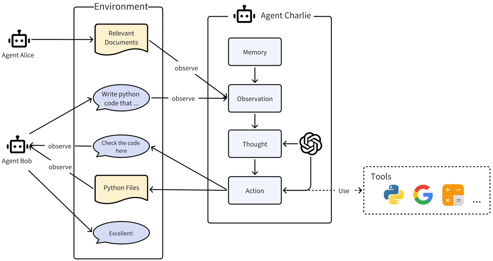
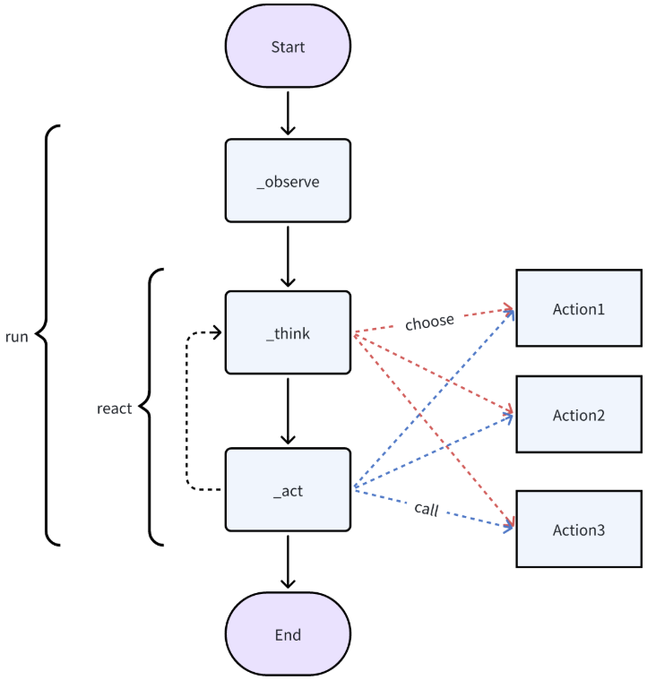

# 1、项目介绍
## 1.1、本次分享介绍                      
(1)MetaGPT框架介绍                                                                             
(2)MetaGPT功能测试                                                     

## 1.2 MetaGPT介绍
MetaGPT是独立开发者发布的一个用于构建AI Agent系统的多智能体开源框架，为了处理复杂任务，将不同的角色分配给GPT模型，形成一个协作性软件公司                                             
MetaGPT内部包括产品经理、架构师、项目经理、工程师，它提供了一个软件公司的全过程与精心调配的SOP                
Code = **SOP(Team) 是核心哲学**。将SOP具象化，并且用于LLM构成的团队                          
MetaGPT从软件公司开始，但它的能力并不局限于此。你可以在自己的场景里使用这个多智能体框架来搭建属于自己的应用                                       
github地址:https://github.com/geekan/MetaGPT                                          
官网地址:https://docs.deepwisdom.ai/main/zh/                                                          
文档地址:https://docs.deepwisdom.ai/main/zh/guide/get_started/introduction.html                                                             
### (1)版本      
**v0.8.1**                  
截止当前(12.5),当前的稳定版本为0.8.1                                 
**开发版本**                    
支持通过源码的方式安装最新版本进行体验                            
pip install git+https://github.com/geekan/MetaGPT             
### (2)核心概念    
**(a)智能体**            
学术界和工业界对术语“智能体”提出了各种定义。大致来说，一个智能体应具备类似人类的思考和规划能力，拥有记忆甚至情感，并具备一定的技能以便与环境、智能体和人类进行交互          
在MetaGPT看来，可以将智能体想象成环境中的数字人，其中                              
**智能体 = 大语言模型(LLM) + 观察(Observation) + 思考(Thought) + 行动(Action) + 记忆(Memory)**                                                    
这个公式概括了智能体的功能本质。为了理解每个组成部分，让我们将其与人类进行类比                              
**大语言模型(LLM):** LLM作为智能体的“大脑”部分，使其能够处理信息，从交互中学习，做出决策并执行行动                            
**观察(Observation):** 这是智能体的感知机制，使其能够感知其环境。智能体可能会接收来自另一个智能体的文本消息、来自监视摄像头的视觉数据或来自客户服务录音的音频等一系列信号。这些观察构成了所有后续行动的基础                  
**思考(Thought):** 思考过程涉及分析观察结果和记忆内容并考虑可能的行动。这是智能体内部的决策过程，其可能由LLM进行驱动                      
**行动(Action):** 这些是智能体对其思考和观察的显式响应。行动可以是利用 LLM 生成代码，或是手动预定义的操作，如阅读本地文件。此外，智能体还可以执行使用工具的操作，包括在互联网上搜索天气，使用计算器进行数学计算等                   
**记忆(Memory):** 智能体的记忆存储过去的经验。这对学习至关重要，因为它允许智能体参考先前的结果并据此调整未来的行动                     
**(b)多智能体**              
多智能体系统可以视为一个智能体社会，其中                 
**多智能体(MultiAgent) = 智能体(Agents) + 环境(Environment) + 标准流程(SOP) + 通信(Communication) + 经济(Economy)**                
这些组件各自发挥着重要的作用                    
**智能体(Agents):** 在上面单独定义的基础上，在多智能体系统中的智能体协同工作，每个智能体都具备特有的LLM、观察、思考、行动和记忆                          
**环境(Environment):** 环境是智能体生存和互动的公共场所。智能体从环境中观察到重要信息，并发布行动的输出结果以供其他智能体使用                 
**标准作业程序(SOP):** 这些是管理智能体行动和交互的既定程序，确保系统内部的有序和高效运作。例如，在汽车制造的SOP中，一个智能体焊接汽车零件，而另一个安装电缆，保持装配线的有序运作                 
**通信(Communication):** 通信是智能体之间信息交流的过程。它对于系统内的协作、谈判和竞争至关重要                    
**经济(Economy):** 这指的是多智能体环境中的价值交换系统，决定资源分配和任务优先级                         
**(c)示意图**             
                 
### (3)Agent 智能体
从实际使用的角度考虑，一个智能体要对我们有用，它必须具备哪些基本要素呢？     
从MetaGPT的观点来看，如果一个智能体能够执行某些动作（无论是由LLM驱动还是其他方式），它就具有一定的用途         
简单来说，定义智能体应该具备哪些行为，为智能体配备这些能力，我们就拥有了一个简单可用的智能体          
**Action**                   
Action类是动作的逻辑抽象                                            
**Role**                           
Role类是智能体的逻辑抽象                    
一个Role能执行特定的Action，拥有记忆、思考并采用各种策略行动                  
基本上，它充当一个将所有这些组件联系在一起的凝聚实体                       
**role.run()**                   
运行角色后智能体则开始工作，只需要初始化它并使用一个起始消息运行它                   
**一个智能体运行周期的流程图**         
            
### (4)Roles:官方提供8种预设Role 
**Role**           
角色的基类，其他6个角色均继承该基类              
自定义Agent角色需继承该基类                  
**Architect**               
代表软件开发流程中的架构师角色                     
其属性如下:                
name (str):角色名称,"Bob"                                                    
profile (str):角色描述信息,"Architect"                                                 
goal (str):主要目标和责任。"用来设计一个简洁、可用、完整的软件系统"                                                    
constraints (str):对角色的限制和指导说明。"确保架构足够简单，并使用适当的开源库。使用与用户需求相同的语言"                                                                      
set_actions([WriteDesign]):指定角色的特定动作                                          
self._watch({WritePRD}):指定角色应关注或注意的事件或动作              
**ProjectManager**               
代表软件开发流程中的负责项目经理角色                                
其属性如下:                 
name (str):角色名称,"Eve"                                                     
profile (str):角色描述信息,"Project Manager"                                                  
goal (str):主要目标和责任。"根据 PRD/技术设计分解任务，生成任务列表，并分析任务"                                                     
constraints (str):对角色的限制和指导说明。"使用与用户需求相同的语言"                                                                       
self.set_actions([WriteTasks]):指定角色的特定动作                                            
self._watch([WriteDesign]):指定角色应关注或注意的事件或动作               
**ProductManager**             
代表软件开发流程中的负责产品经理角色                                
其属性如下:                 
name (str):角色名称,"Alice"                                                     
profile (str):角色描述信息,"Product Manager"                                                  
goal (str):主要目标和责任。"高效率地创造出满足市场需求和用户期望的成功产品"                                                     
constraints (str):对角色的限制和指导说明。"使用与用户需求相同的语言"                                                                       
self.set_actions([PrepareDocuments, WritePRD]):指定角色的特定动作                                            
self._watch([UserRequirement, PrepareDocuments]):指定角色应关注或注意的事件或动作                        
**Engineer**               
代表软件开发流程中的负责研发工程师角色                                
其属性如下:                 
name (str):角色名称,"Alex"                                                     
profile (str):角色描述信息,"Engineer"                                                  
goal (str):主要目标和责任。"编写全面、稳健的测试，确保代码按预期运行，不出现错误"                                                     
constraints (str):对角色的限制和指导说明。"代码应符合谷歌风格等标准，并具有模块化和可维护性。使用与用户需求相同的语言"                                                                       
self.set_actions([WriteCode]):指定角色的特定动作                                            
self._watch([WriteTasks, SummarizeCode, WriteCode, WriteCodeReview, FixBug, WriteCodePlanAndChange]):指定角色应关注或注意的事件或动作                  
**QaEngineer**            
代表软件开发流程中的负责质量工程师角色                                
其属性如下:                 
name (str):角色名称,"Edward"                                                     
profile (str):角色描述信息,"QaEngineer"                                                  
goal (str):主要目标和责任。"编写优雅、可读、可扩展、高效的代码"                                                     
constraints (str):对角色的限制和指导说明。"编写的测试代码应符合 PEP8 等代码标准、模块化、易于阅读和维护"                                                                       
self.set_actions([WriteTest]):指定角色的特定动作                                            
self._watch([SummarizeCode, WriteTest, RunCode, DebugError]):指定角色应关注或注意的事件或动作             
**Searcher**          
代表软件开发流程中的负责搜索器角色                                
其属性如下:                 
name (str):角色名称,"Alice"                                                     
profile (str):角色描述信息,"Smart Assistant"                                                  
goal (str):主要目标和责任。"为用户提供搜索服务"                                                     
constraints (str):对角色的限制和指导说明。"答案丰富而完整"                     
search_engine:搜索引擎设置，默认None                                               
self.set_actions([SearchAndSummarize]):指定角色的特定动作             
### (5)Team:智能体团队
总的来说，需要三个步骤来建立Team并使其运作             
(a)定义每个角色能够执行的预期动作                  
(b)基于标准作业程序（SOP）确保每个角色遵守它。通过使每个角色观察上游的相应输出结果，并为下游发布自己的输出结果                       
(c)初始化所有角色，创建一个带有环境的智能体团队，并使它们之间能够进行交互                    
其属性如下:           
roles:加入团队的角色(智能体)           
environment:环境，共享上下文              
idea:指定用户初始任务消息                                                
investment:能用于模拟开发资源或评估开发成本                                     
n_round:指定需要运行的迭代次数                               
add_human:指定是否在团队中添加一个人类角色                            

# 2、前期准备工作
## 2.1 开发环境搭建:anaconda、pycharm
anaconda:提供python虚拟环境，官网下载对应系统版本的安装包安装即可                                      
pycharm:提供集成开发环境，官网下载社区版本安装包安装即可                                               
可参考如下视频进行安装，【大模型应用开发基础】集成开发环境搭建Anaconda+PyCharm                                                          
https://www.bilibili.com/video/BV1q9HxeEEtT/?vd_source=30acb5331e4f5739ebbad50f7cc6b949                             
https://youtu.be/myVgyitFzrA          

## 2.2 大模型相关配置
(1)GPT大模型使用方案              
(2)非GPT大模型(国产大模型)使用方案(OneAPI安装、部署、创建渠道和令牌)                 
(3)本地开源大模型使用方案(Ollama安装、启动、下载大模型)                         
可参考如下视频:                         
提供一种LLM集成解决方案，一份代码支持快速同时支持gpt大模型、国产大模型(通义千问、文心一言、百度千帆、讯飞星火等)、本地开源大模型(Ollama)                       
https://www.bilibili.com/video/BV12PCmYZEDt/?vd_source=30acb5331e4f5739ebbad50f7cc6b949                 
https://youtu.be/CgZsdK43tcY           

# 3、项目初始化
## 3.1 下载源码
GitHub或Gitee中下载工程文件到本地，下载地址如下：                
https://github.com/NanGePlus/MetaGPTTest                                                               
https://gitee.com/NanGePlus/MetaGPTTest                                     

## 3.2 构建项目
使用pycharm构建一个项目，为项目配置虚拟python环境               
项目名称：MetaGPTTest                                                   

## 3.3 将相关代码拷贝到项目工程中           
直接将下载的文件夹中的文件拷贝到新建的项目目录中               

## 3.4 安装项目依赖                        
命令行终端中执行如下命令安装依赖包                               
pip install metagpt==0.8.1 asyncio==3.4.3                                            
     

# 4、测试
## 4.1配置LLM                            
大模型参数的配置提供两种方式                                  
**(1)使用官方的命令生成配置文件**                 
打开命令行终端运行如下指令 metagpt --init-config 指令运行成功后，配置文件所在目录如下                          
~/.metagpt/config2.yaml                    
**(2)手动创建配置文件**                 
在当前的代码同级目录下手动创建配置文件                   
创建config文件夹，并在该文件夹内创建config2.yaml文件                    
**(3)config2.yaml参数设置如下**                      
llm:                      
  api_type: "openai"                      
  model: "gpt-4o-mini"                    
  base_url: "https://yunwu.ai/v1"                     
  api_key: "sk-w39WoB6J0FdXcoUoEC5S3fMgmqx3GQURX08NkUDso93Rl88t"                   
**(4)配置文件读取顺序**                
将按照以下优先顺序读取设置                    
~/.metagpt/config2.yaml > config/config2.yaml                                 

## 4.2 运行脚本测试         
脚本均放置在nangeAGICode目录内                
**(1)运行脚本后报错解决**                      
打开命令行终端运行脚本，可能会出现如下报错信息                  
TypeError: AsyncClient.__init__() got an unexpected keyword argument 'proxies'                            
原因为httpx的版本问题，执行如下命令更换版本                                         
pip install --upgrade httpx==0.27.2                            

**(2)脚本测试**            
打开命令行终端运行脚本进行功能测试             

   

